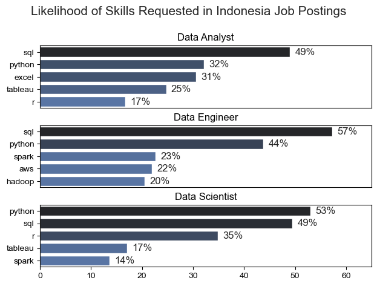

# Overview 
Welcome to my analysis of the data job market, with a particular focus on data analyst roles. This project was developed to better understand current industry trends and identify strategic opportunities within the field. It examines high paying and in-demand skills to uncover insights that can help aspiring and transitioning professionals make data-driven career decisions.

The dataset used in this analysis is sourced from [Luke Barousse's Python Course](https://lukebarousse.com/python), providing comprehensive information on job titles, salaries, locations, and required skills. Using Python for data cleaning, exploration, and visualization, this project addresses key questions such as: What skills are most in demand? How do salaries vary across roles and locations? And which skills offer the strongest combination of demand and compensation in the data analytics market?

# The Questions
Below are the questions I want to answer in my project:

1. What are the skills most in demand for the top 3 most popular data roles?
2. How are in-demand skills trending for Data Analysts?
3. How well do jobs and skills pay for Data Analysts?
4. What are the optimal skills for data analysts to learn? (High Demand AND High Paying)

# Tools & Technologies
For this deep dive into the data analyst job market, I leveraged several key tools and technologies:

- Python – The core programming language used for data cleaning, analysis, and insight generation.
- Pandas – Utilized for data manipulation, transformation, and exploratory data analysis (EDA).
- Matplotlib – Used to create foundational data visualizations.
- Seaborn – Applied to develop more advanced and aesthetically refined statistical visualizations.
- Jupyter Notebook – Enabled interactive analysis by combining code, visualizations, and explanatory notes in a single environment.
- Visual Studio Code – Served as my primary code editor for development and project organization.
- Git & GitHub – Used for version control, project tracking, and sharing code to ensure reproducibility and collaboration.

# Data Preparation and Cleaning
This section outlines the processes undertaken to prepare the dataset for analysis, ensuring data accuracy, consistency, and overall usability. Proper data preparation is essential to produce reliable and meaningful insights.

# Importing and Cleaning the Data
The process begins with importing the necessary Python libraries and loading the dataset into the analysis environment. Initial data cleaning steps include handling missing values, checking for duplicates, standardizing column formats, and correcting data types where necessary. These steps ensure the dataset is structured, consistent, and ready for exploratory analysis and visualization.

```python
# import library 
import pandas as pd
import matplotlib.pyplot as plt
import ast
import seaborn as sns
from datasets import load_dataset

# load data 
dataset = load_dataset('lukebarousse/data_jobs')
df = dataset['train'].to_pandas()

# data cleanup 
df['job_posted_date'] = pd.to_datetime(df['job_posted_date'])
df['job_skills'] = df['job_skills'].apply(lambda x : ast.literal_eval(x) if pd.notna(x) else x)
```

# Filtering Indonesia Based Roles
To ensure geographic consistency and improve the relevance of the analysis, the dataset was filtered to include only job postings located in Indonesia. This step allows for a more accurate evaluation of salary benchmarks, skill demand, and market trends within the Indonesian labor market, while reducing variability caused by differences in compensation standards and hiring practices across countries.

```python
df_DA_INA = df[(df['job_country'] == 'Indonesia') & (df['job_title_short'] == 'Data Analyst')].copy()
```

# The Analysis
Each Jupyter Notebook in this project was designed to investigate a specific aspect of the data job market. To ensure a structured and systematic analysis, I organized the workflow so that each notebook addressed one key research question. Below is an overview of how each question was explored and analyzed.

## 1. What are the most demanded skills for the top 3 most popular data roles?

To find the most demanded skills for the top 3 most popular data roles. I filtered out those positions by which ones were the most popular, and got the top 5 skills for these top 3 roles. This query highlights the most popular job titles and their top skills, showing which skills I should pay attention to depending on the role I’m targeting. 

View my notebook with detailed steps here: [2_Skills_Count.ipynb](2_Projects/2_Skills_Count.ipynb)

### Visualize Data

```python
fig, ax = plt.subplots(len(job_titles), 1)

for i, job_title in enumerate(job_titles):
    df_plot = df_skills_count[df_skills_count['job_title_short'] == job_title].head(5)
    df_plot.plot(kind='barh', x='job_skills', y='skill_count', ax=ax[i], title=job_title)
    ax[i].invert_yaxis()
    ax[i].set_ylabel('')
    ax[i].legend().set_visible(False)

fig.suptitle('Counts of Top Skills in Job Postings', fontsize=15)
fig.tight_layout(h_pad=0.5)
plt.show()
```

### Results 

 

*Bar graph visualizing the salary for the top 3 data roles and their top 5 skills associated with each.*

### Insights 
- Python is a highly versatile skill that is in demand across all three data roles. Its importance is especially evident for Data Scientists (53%) and Data Engineers (44%), highlighting its role as a core programming language in advanced data processing and modeling tasks.
- SQL remains the most requested skill for Data Analysts and Data Engineers, appearing in over half of job postings for both roles. This indicates that SQL is a foundational competency in the data field, as it is essential for querying, managing, and transforming structured data. For Data Engineers in particular, Python and SQL together form the primary technical requirements.
- Data Engineers are expected to possess more specialized technical skills, such as AWS, Spark, and Hadoop, reflecting the infrastructure-focused nature of the role. In contrast, Data Analysts and Data Scientists are more frequently required to demonstrate proficiency in general data analysis and visualization tools such as Excel and Tableau, emphasizing reporting, interpretation, and business insight generation.


## 2. How are in-demand skills trending for Data Analytics?
To analyze skill trends for Data Analysts in 2025, I first filtered the dataset to include only Data Analyst roles. I then grouped job postings by month and aggregated the listed skills to measure their frequency over time. This approach allowed me to identify the top five most in-demand skills for each month, providing insight into how skill demand evolved throughout the year.

You can view the complete analysis and detailed methodology in the notebook: [3_Skills_Trend](2_Projects/2_Skills_Count.ipynb)

### Visualize Data
```python
df_plot = df_DA_INA_percent.iloc[:, :5]

sns.lineplot(df_plot, dashes=False, palette='tab10')
sns.set_theme(style='ticks')
sns.despine()

from matplotlib.ticker import PercentFormatter
ax = plt.gca()
ax.yaxis.set_major_formatter(PercentFormatter(decimals=0))

for i in range(5):
    plt.text(11.2, df_plot.iloc[-1, i], df_plot.columns[i])

plt.show()
```
### Result


*Graph visualizing the trending top skills for data analysts in Indonesia in 2025*

### Insight
- SQL is the most in-demand skill throughout the year, consistently leading other tools and remaining the core requirement for data analyst roles in Indonesia.
- Python and Excel are strong complementary skills, frequently competing for second place and showing steady relevance across most months.
- Tableau and R have more fluctuating and lower demand, with R being the least requested skill overall, indicating it is more niche compared to other tools.


## 3. How well do jobs and skills pay for Data Analysts?
You can view the complete analysis and detailed methodology in the notebook: [4_Salary_Analysis](2_Projects\4_Salary_Analysis.ipynb)

#### Visualize Data

```python
sns.boxplot(data=df_INA_top6, x='salary_year_avg', y='job_title_short', order=job_order)
sns.set_theme(style='ticks')

ticks_x = plt.FuncFormatter(lambda y, pos: f'Rp.{int(y/1000)} Mil')
plt.gca().xaxis.set_major_formatter(ticks_x)
plt.show()
```

#### Results

 

*Box plot visualizing the salary distributions for the top 6 data job titles.*

#### Insight

- Machine Learning Engineers and Data Engineers have the highest salary ranges, with upper values reaching around Rp150–160 million per year, indicating strong market value for technical and infrastructure-focused roles.
- Data Scientists and Data Analysts fall in the mid-range, generally between Rp60–110 million, with some higher outliers (especially for Data Scientists).
- Business Analysts have the lowest salary distribution overall, typically concentrated around Rp50–60 million, showing a noticeable gap compared to more technical data roles.

### Highest Paid & Most Demanded Skills for Data Analysts
Next, I refined the analysis by focusing exclusively on Data Analyst roles. Within this subset, I examined two key dimensions: the highest paying skills (based on median salary) and the most in-demand skills (based on frequency of job postings).

To effectively communicate these insights, I used two separate bar charts one highlighting salary by skill and the other illustrating skill demand allowing for a clear comparison between compensation and market demand.

#### Visualize Data

```python
fig, ax = plt.subplots(2,1)

sns.set_theme(style='ticks')

# top 10 Highest Paid Skills for Data Analyst
sns.barplot(data=df_DA_top_pay, ax=ax[0], x='median', y=df_DA_top_pay.index, hue='median', palette='dark:b_r')

# top 10 Most In-Demand Skills for Data Analyst
sns.barplot(data=df_DA_skills, ax=ax[1], x='median', y=df_DA_skills.index, hue='median', palette='light:b')

plt.tight_layout()
plt.show()
```

#### Results 


*Two Separate bar graphs visualizing the highest paid skills and most in-demand skills for data analysts in Indonesia*

#### Insights

- Power BI leads both in salary and demand, making it the most strategically valuable skill for data analysts. Tableau and SQL also rank high in both categories, showing strong market alignment between pay and demand.
- Some skills are high-paying but less in demand, such as JavaScript and Looker, suggesting they are specialized or niche but financially rewarding.
- Technical/data engineering tools (AWS, Python, R, Hadoop, BigQuery) appear in either high salary or high demand lists, indicating that combining analytics skills with technical/cloud capabilities increases market value.


## 4. What is the most optimal skill to learn for Data Analysts?
To identify the most optimal skills to learn defined as those that are both high paying and highly in demand. I calculated two key metrics: the percentage of job postings requiring each skill and the median salary associated with those skills.

By combining demand (frequency) and compensation (median salary), I was able to evaluate the relative value of each skill and highlight those that offer the strongest balance between market demand and earning potential.

You can view the complete analysis and detailed methodology in the notebook: [5_Optimal_Skills](2_Projects\5_Optimal_Skills.ipynb)

#### Visualize Data

```python
df_DA_skills_high_demand.plot(kind='scatter', x = 'skill_percentage', y = 'median_salary') 

ax = plt.gca()
ax.yaxis.set_major_formatter(plt.FuncFormatter(lambda y, pos: f'Rp {int(y/1000)}M'))
ax.xaxis.set_major_formatter(PercentFormatter(decimals=0))

plt.tight_layout()
plt.show()
```

#### Results


*A scatter plot visualizing the most optimal skills (high paying & high demand) for data analysts in Indonesia*

#### Insights:
- SQL and Python stand out as the most optimal skills, combining relatively high median salaries (around Rp91–98M) with strong job demand (especially SQL at nearly 60%).
- Tableau and Power BI offer balanced value, with moderate-to-high demand and solid salaries, making them practical complementary skills for data analysts.
- Basic tools like Word and PowerPoint show lower salary impact, while niche/cloud skills like Oracle provide high salaries but lower demand, indicating specialization rather than broad market need.


# What I Learned

Throughout this project, I strengthened both my understanding of the data analyst job market and my technical proficiency in Python, particularly in data manipulation, analysis, and visualization. Key takeaways from this project include:

- *Advanced Python Application:* I enhanced my ability to use Pandas for data cleaning and transformation, and Matplotlib and Seaborn for creating clear and insightful visualizations. This project improved my confidence in handling real world datasets and performing end to end exploratory data analysis.
- *The Importance of Data Preparation*: I learned that thorough data cleaning and preprocessing are critical steps in any analytical workflow. Handling missing values, correcting data types, and validating assumptions significantly impact the reliability and accuracy of insights.
- *Strategic Skill Evaluation*: This project reinforced the value of aligning technical skills with market demand. By analyzing the relationship between skill demand, salary levels, and job availability, I gained a more data driven perspective on career development within the tech industry.


# Insights
This project generated several meaningful insights into the data analyst job market:

- *Correlation Between Skill Demand and Salary*: The analysis revealed a positive relationship between skill demand and compensation. Specialized and technically advanced skills — such as Python and Oracle — are consistently associated with higher median salaries, indicating that technical depth often translates into greater earning potential.
- *Evolving Market Trends*: Skill demand is not static; it shifts over time in response to technological advancements and industry needs. Monitoring these trends is essential for professionals who want to remain competitive and relevant in the data analytics field.
- *Economic Value of Strategic Skill Development*: By identifying skills that are both highly demanded and well-compensated, data analysts can make more informed learning decisions. Prioritizing these “high-value” skills enables professionals to maximize their return on investment in skill development.


# Challenges I Faced
While this project presented several challenges, each obstacle became a valuable learning opportunity:

- *Data Inconsistencies and Quality Issues*: Managing missing values, inconsistent entries, and varying data formats required careful validation and structured cleaning techniques. This experience reinforced the importance of data integrity as the foundation of any reliable analysis.
- *Complex Data Visualization*: Transforming complex datasets into clear and compelling visualizations was both challenging and essential. It required thoughtful selection of chart types, effective labeling, and strategic simplification to ensure insights were communicated accurately and intuitively.
- *Balancing Analytical Depth and Scope*: Striking the right balance between deep technical exploration and maintaining a broad market overview required deliberate decision-making. This process strengthened my ability to prioritize analyses that deliver meaningful insights without overcomplicating the narrative.


# Conclusion
This exploration of the data analyst job market provided valuable insights into the skills, salary dynamics, and evolving trends that define the field. The findings not only strengthened my understanding of the current market landscape but also offered actionable guidance for professionals seeking to grow strategically within data analytics.

As the industry continues to evolve alongside technological advancements, continuous monitoring of skill demand and compensation trends remains essential. This project serves as a strong analytical foundation for future research and reinforces the importance of continuous learning, adaptability, and data driven decision making in building a sustainable career in the data field.
